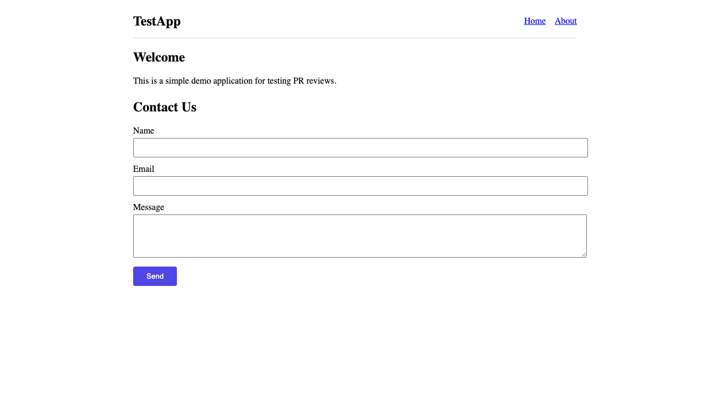
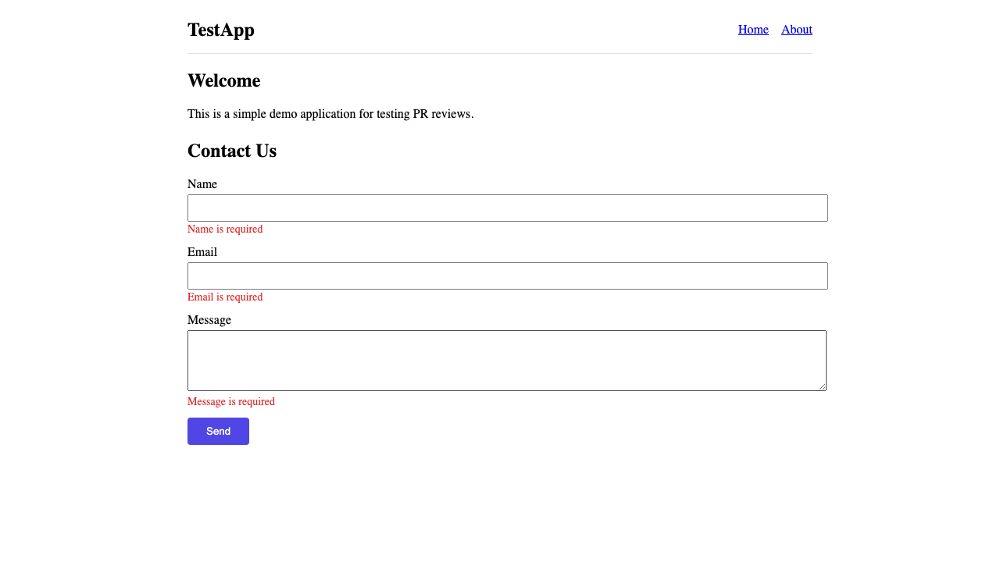
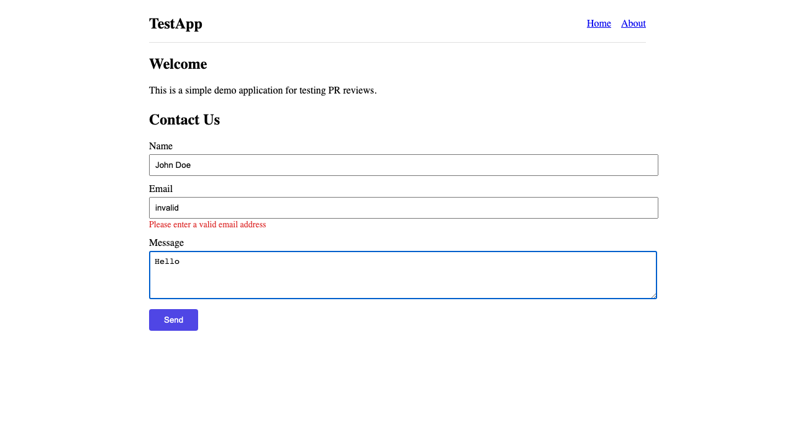
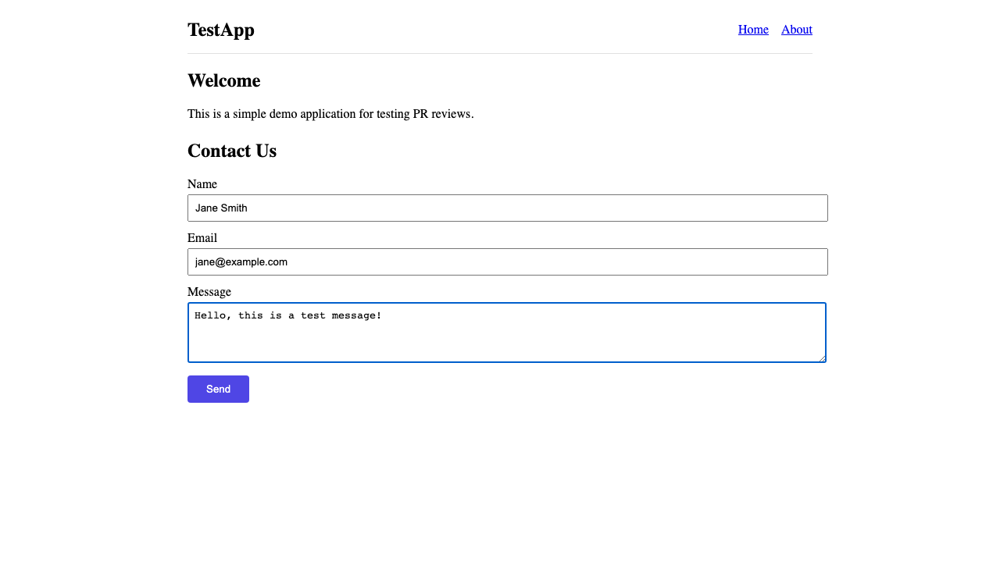
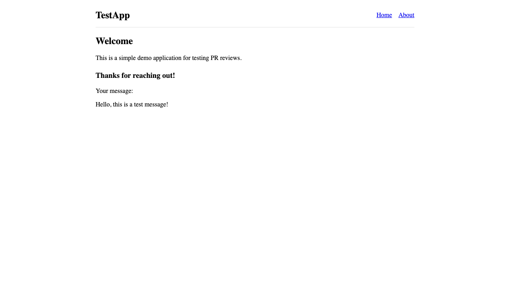
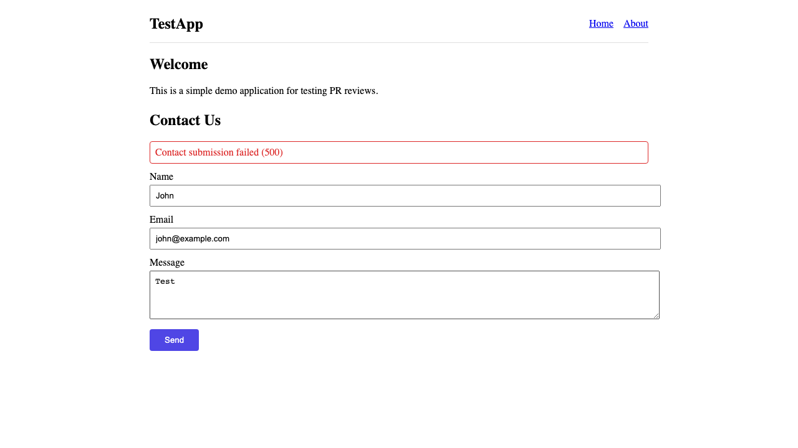

## Automated PR Review


   

> [!CAUTION]
> **XSS vulnerability via unsafe HTML rendering** — User-controlled input rendered as raw HTML allows arbitrary script execution. Fixed by rendering as React text content instead.
> ```diff
> - <div dangerouslySetInnerHTML={{ __html: responseMsg }} />
> + <div data-testid="submitted-message">{responseMsg}</div>
> ```
> [`ContactForm.tsx#L28`](https://github.com/mshuffett/pr-review-test-react/blob/2b2e952cef29587844788ebb28a2a71d8a84e7ae/src/components/ContactForm.tsx#L28)
>
> **Sensitive data logging** — User PII (name, email, message body) logged to `console.log` in production code.
> ```diff
> - console.log("Submitting contact form:", JSON.stringify(payload));
> ```
> [`contact.ts#L16`](https://github.com/mshuffett/pr-review-test-react/blob/2b2e952cef29587844788ebb28a2a71d8a84e7ae/src/api/contact.ts#L16)
>
> **No error handling on API call** — `.then()` with no `.catch()` silently swallows network and server errors.
> ```diff
> - submitContact({ name, email, message }).then(() => {
> -   setSubmitted(true);
> -   setResponseMsg(message);
> - });
> + try {
> +   await submitContact({ name, email, message });
> +   setSubmitted(true);
> +   setResponseMsg(message);
> + } catch (err) {
> +   setSubmitError(err instanceof Error ? err.message : "Failed to send message.");
> + }
> ```
> [`ContactForm.tsx#L16`](https://github.com/mshuffett/pr-review-test-react/blob/2b2e952cef29587844788ebb28a2a71d8a84e7ae/src/components/ContactForm.tsx#L16)

<details>
<summary><strong>All issues (4 more)</strong></summary>

| Sev | Issue | Fix | Link |
|:---:|-------|-----|:----:|
| 🟠 | No input validation — empty name, email, message accepted | Added `validate()` with required + email regex checks | [`ContactForm.tsx#L14-16`](https://github.com/mshuffett/pr-review-test-react/blob/2b2e952cef29587844788ebb28a2a71d8a84e7ae/src/components/ContactForm.tsx#L14) |
| 🟠 | No `res.ok` check — JSON parse on error responses | Added `if (!res.ok) throw new Error(...)` | [`contact.ts#L26`](https://github.com/mshuffett/pr-review-test-react/blob/2b2e952cef29587844788ebb28a2a71d8a84e7ae/src/api/contact.ts#L26) |
| 🟡 | Missing a11y — labels not associated with inputs via `htmlFor`/`id` | Added `htmlFor` + `id`, `aria-required`, `aria-invalid`, `aria-describedby` | [`ContactForm.tsx#L39-65`](https://github.com/mshuffett/pr-review-test-react/blob/2b2e952cef29587844788ebb28a2a71d8a84e7ae/src/components/ContactForm.tsx#L39) |
| 🟡 | Email uses `type="text"` instead of `type="email"` | Changed to `type="email"` | [`ContactForm.tsx#L50`](https://github.com/mshuffett/pr-review-test-react/blob/2b2e952cef29587844788ebb28a2a71d8a84e7ae/src/components/ContactForm.tsx#L50) |

</details>

<details>
<summary><strong>Tests (30 added, all passing)</strong></summary>

| Suite | Count | Type | Link |
|-------|:-----:|:----:|:----:|
| ContactForm unit tests | 17 | Unit | [`ContactForm.test.tsx`](https://github.com/mshuffett/pr-review-test-react/blob/2b2e952cef29587844788ebb28a2a71d8a84e7ae/src/components/__tests__/ContactForm.test.tsx) |
| contact API unit tests | 4 | Unit | [`contact.test.ts`](https://github.com/mshuffett/pr-review-test-react/blob/2b2e952cef29587844788ebb28a2a71d8a84e7ae/src/api/__tests__/contact.test.ts) |
| Header unit tests (existing) | 2 | Unit | [`Header.test.tsx`](https://github.com/mshuffett/pr-review-test-react/blob/2b2e952cef29587844788ebb28a2a71d8a84e7ae/src/components/__tests__/Header.test.tsx) |
| Contact Form e2e tests | 7 | E2E | [`contact-form.spec.ts`](https://github.com/mshuffett/pr-review-test-react/blob/2b2e952cef29587844788ebb28a2a71d8a84e7ae/e2e/contact-form.spec.ts) |

**Unit test output (vitest):**
```
 ✓ src/api/__tests__/contact.test.ts (4 tests) 2ms
 ✓ src/components/__tests__/Header.test.tsx (2 tests) 22ms
 ✓ src/components/__tests__/ContactForm.test.tsx (17 tests) 99ms

 Test Files  3 passed (3)
      Tests  23 passed (23)
```

**E2E test output (Playwright):**
```
 ✓ Contact Form › renders the contact form (650ms)
 ✓ Contact Form › shows validation errors when submitting empty form (656ms)
 ✓ Contact Form › shows email validation error for invalid email (618ms)
 ✓ Contact Form › submits form successfully with valid data (671ms)
 ✓ Contact Form › renders submitted message as text not HTML (XSS prevention) (636ms)
 ✓ Contact Form › shows error when API call fails (651ms)
 ✓ Contact Form › has proper accessibility attributes (570ms)

 7 passed (5.4s)
```

</details>

### UI Verification

<details>
<summary><strong>Contact Form — Initial State</strong></summary>



</details>

<details>
<summary><strong>Contact Form — Validation Errors</strong></summary>

<table>
<tr>
<td align="center"><strong>Empty fields</strong></td>
<td align="center"><strong>Invalid email</strong></td>
</tr>
<tr>
<td></td>
<td></td>
</tr>
</table>

</details>

<details>
<summary><strong>Contact Form — Successful Submission</strong></summary>

<table>
<tr>
<td align="center"><strong>Filled form</strong></td>
<td align="center"><strong>After submit</strong></td>
</tr>
<tr>
<td></td>
<td></td>
</tr>
</table>

</details>

<details>
<summary><strong>Contact Form — Error & Security States</strong></summary>

<table>
<tr>
<td align="center"><strong>API error</strong></td>
<td align="center"><strong>XSS safe (script rendered as text)</strong></td>
</tr>
<tr>
<td></td>
<td></td>
</tr>
</table>

</details>
